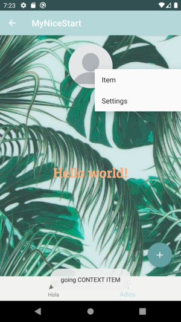
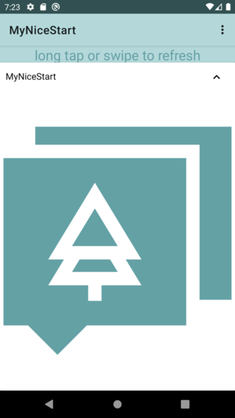

# NiceStart
### Por Alejandro García García ([alxgarci en github](https://github.com/alxgarci))

**Mi primer proyecto material.**

La aplicación se basa en tonos verdes y colores pálidos.
Contiene una paleta agradable a la vista que se presenta  
al usuario por medio de botones característicos del tema
material de google.

## Activities de la Aplicación
Splash | Login | SignUp
-------|------ |-------
 |   | 

MainActivity | MainActivity2
-------|------
 | 

## Funcionalidad

Menú Contextual | Menú AppBar | Menú BottomNavigation
-------|------ |-------
 |   | 

SwipeRefreshLayout con SnackBar | Alert/Modal Dialog | Expandable Cardview
-------|------ |-------
 |   | 

- La Prueba de instrumentación del login se encuentra [aquí](https://github.com/alxgarci/MyNiceStart/tree/master/app/src/androidTest/java/com/dam/interfaces/mynicestart)

- El app-release.aab se encuentra [aquí](https://github.com/alxgarci/MyNiceStart/tree/master/app/release)

Menú Contextual
Menú AppBar
Menú BottomBar (o BottomNavigation)
SwipeRefreshLayout con SnackBar
Alert/Modal Dialog
Expandable Cardview
Prueba de instrumentación del Login.
app-release.apk o .aab
README.md incluyendo cada una de estas funcionalidades.