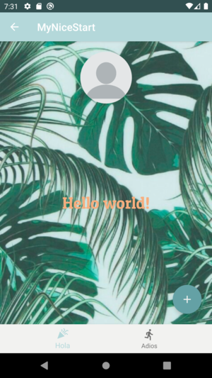

# NiceStart
[alxgarci en github](https://github.com/alxgarci)

**Mi primer proyecto material.**

La aplicación se basa en tonos verdes y colores pálidos.
Contiene una paleta agradable a la vista que se presenta  
al usuario por medio de botones característicos del tema
material de google.

Splash | Login | SignUp
-------|------ |-------
 |   | 

MainActivity | MainActivity2
-------|------
 | 
